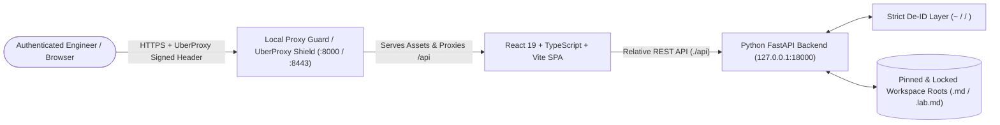

# Local Markdown Explorer (`local-md`)

[](https://creativecommons.org/licenses/by-sa/4.0/)
[-blue)](https://github.com/jpaquay)
[](https://react.dev/)
[](https://fastapi.tiangolo.com/)
[](#%EF%B8%8F-cloudtop--zero-trust-proxy-guard-architecture)

A fast, single-page web GUI and Codelab presentation engine to browse, search, and render Markdown documents, Codelabs, and repository structures across any configurable directory tree. Designed for seamless operation behind **Zero-Trust Local Proxy Guard** on Cloudtop workstations and local developer environments.

---

## 🏗️ System Architecture



For a complete engineering, security, and hygiene review, see [docs/ARCHITECTURE_REVIEW.md](./docs/ARCHITECTURE_REVIEW.md).

---

## ✨ Key Features

- ⚡ **Vite + React 19 + TypeScript**: Modern, ultra-fast frontend build with relative asset/API resolution (`./api` & `/port/<port>/api`).
- 🛡️ **Zero-Trust Proxy Guard Ready**: Automatically detects Local Proxy Guard (`~/.config/iap_guard/allowlist.json`), isolates its backend on `127.0.0.1:18000`, and serves authenticated traffic over both public port `:8000` (UberProxy Shield) and Carbon Gateway (`/port/8000/`).
- 📌 **Multi-Modal Root Pinning & Locking**:
  - **At Setup Time (CLI)**: Pin and lock a specific workspace root (`./run.sh --pin-root ~/dev/cloud-gtm`).
  - **Environment File (`.env`)**: Define `ROOT_DIR`, `PINNED_ROOTS`, and `LOCK_ROOT=true|false`.
  - **Interactive GUI**: Pin/unpin favorite root directories, set the persistent startup default root in `.env`, or lock/unlock root directory switching on the fly.
- 🧹 **Clean Cloudtop Directory Listing**: Filters noisy build artifacts (`node_modules`, `__pycache__`, `.venv`, `dist`, `build`, `go`, `google-cloud-sdk`) and dotfiles by default, with a 1-click **Show/Hide Dotfiles (`.` toggle)** in the sidebar filter bar to inspect `.agents` or `.env.example`.
- 🔒 **Strict De-ID (Zero PII)**: All API responses, UI breadcrumbs, configuration files, and console logs strictly replace user home paths, usernames, and hostnames with `~`, `<user>`, and `<cloudtop-host>`. Never leaks PII to GitHub or screenshots.
- 🔍 **Live Full-Text Search (`Cmd+K`)**: Rapid keyword and filename search across all Markdown files in the active root with highlighted snippet previews.
- 📐 **Rich Markdown & Codelab Engine**:
  - Mermaid diagram rendering (`sequenceDiagram`, `graph`, `classDiagram`, `architectureDiagram`).
  - Google Cloud Codelab aside boxes (`> aside positive`, `> aside negative`) and GitHub callouts (`[!NOTE]`, `[!WARNING]`, `[!IMPORTANT]`).
  - LaTeX / KaTeX math support (`$inline$` and `$$block$$`).
  - Highlight.js syntax highlighting with language tags and 1-click **Copy Code** buttons.

---

## 🚀 Quickstart & Idempotent Launcher (`run.sh`)

The launcher script (`./run.sh`) is **100% idempotent**. Running it repeatedly will automatically terminate any stale `server.py` process on the target port and restart cleanly without `Address already in use` errors.

### 1. Standard Launch (Foreground or Daemon)

```bash
# Start in foreground (auto-detects Proxy Guard and binds 127.0.0.1:18000 if active)
./run.sh

# Start in background daemon mode (logs to /tmp/local-md.log)
./run.sh --daemon
```

### 2. Pinning a Specific Root at Setup Time

```bash
# Pin and lock the root directory to ~/dev/cloud-gtm and persist to .env
./run.sh --pin-root ~/dev/cloud-gtm --daemon

# Start with a custom root without locking
./run.sh --root ~/dev --daemon
```

### 3. Configuring via `.env`

Copy `.env.example` to `.env` (gitignored) to customize your persistent defaults:

```ini
# Default / Pinned Startup Root Directory (supports ~ expansion)
ROOT_DIR=~/dev/cloud-gtm

# Comma-separated list of Pinned Root Directories shown in the GUI switcher
PINNED_ROOTS=~/dev/cloud-gtm,~/dev,~

# Lock root directory to prevent switching outside the startup root (true/false)
LOCK_ROOT=false

# Server Bind Address & Port (Internal loopback for Proxy Guard Shield)
HOST=127.0.0.1
PORT=18000
PUBLIC_PORT=8000
```

---

## 🛡️ Cloudtop & Zero-Trust Proxy Guard Architecture

When deployed alongside **Local Proxy Guard (`local-proxy-guard`)**:

1. **Public Shield Port (`:8000`)**: Proxy Guard listens on dual-stack `[::]:8000` & `0.0.0.0:8000`, verifying Google UberProxy cryptographic headers (`x-uberproxy-signed-uptick`) or local loopback origin.
2. **Isolated Backend (`127.0.0.1:18000`)**: `local-md` binds strictly to `127.0.0.1:18000` so unauthenticated network peers cannot bypass Proxy Guard.
3. **Access URLs**:
   - **Direct Shield URL**: `https://<uberproxy-host>.proxy.googlers.com/` (or `http://localhost:8000/` locally)
   - **Carbon Control Center Gateway**: `https://<cloudtop-host>:8443/port/8000/`

---

## 🔌 API Endpoints

- `GET /api/health`: Returns service status, De-ID active root, and lock state.
- `GET /api/config`: Returns De-ID active root, `pinned_roots`, `quick_roots`, and `is_locked` status.
- `POST /api/config/root`: Dynamically updates active root (`{"root_path": "~/dev", "pin_as_default": true}`).
- `POST /api/config/pin`: Pins/unpins presets (`pin` / `unpin`), sets startup default (`set_default`), or toggles root lock (`toggle_lock`) in `.env`.
- `GET /api/browse?path=...&show_hidden=false`: Returns clean directory items, file metadata, and De-ID breadcrumbs.
- `GET /api/file?path=...`: Returns file content, extracted TOC, frontmatter, and reading stats.
- `GET /api/search?q=...`: Performs bounded-depth full-text and filename search across the active root.
- `GET /api/stats`: Returns markdown file counts and recently modified documents.

---

## 🤝 Contributing

Contributions, issues, and feature requests are welcome! Please review [CONTRIBUTING.md](./CONTRIBUTING.md) before submitting pull requests.

---

## 👏 Credits & Author

Designed, architected, and maintained by **Jerome CG Paquay (`@jpaquay`)** — [https://github.com/jpaquay](https://github.com/jpaquay).

---

## 📜 License

This project is licensed under the **Creative Commons Attribution-ShareAlike 4.0 International License (`CC BY-SA 4.0`)** — Copyright © 2026 **Jerome CG Paquay (`@jpaquay`)**. See [LICENSE](./LICENSE) for full legal terms.
