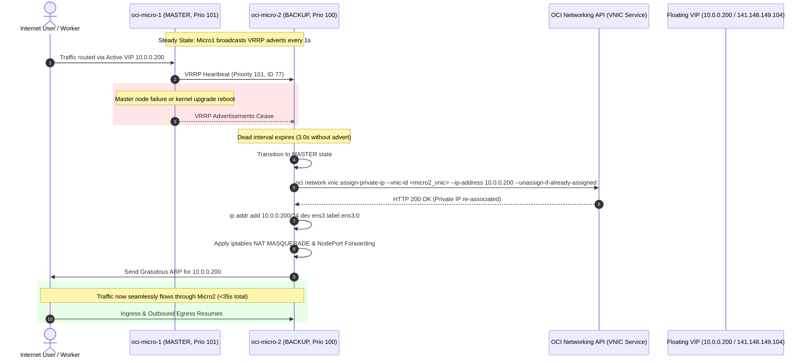

# High-Availability NAT & Ingress Gateway (VRRP)

This document details the redundant dual-gateway architecture deployed on `oci-micro-1` and `oci-micro-2` in `us-phoenix-1`, managing floating private VIP `10.0.0.200` and reserved public IP `141.148.149.104`.

---

## 🎯 Architectural Goals

1. **Eliminate Single Point of Failure (SPOF):** Neither a gateway VM crash, planned OS upgrade, nor physical hardware fault may disrupt outbound internet access for private ARM worker nodes.
2. **Transparent Ingress & Egress:** Ingress HTTPS traffic from `141.148.149.104` and egress traffic from workers route seamlessly through the currently active master node.
3. **Automated OCI API VIP Migration:** Use OCI Instance Principal authentication within a Keepalived state change hook to reassign the secondary private IP `10.0.0.200` at the cloud control plane level.

---

## 🔄 Failover Sequence & State Machine



---

## ⚙️ Core Configuration

### 1. OCI IAM Dynamic Group & Policy
Gateways authenticate to the OCI API using **Instance Principals**, eliminating static API keys on the filesystem:

- **Dynamic Group:** `WireGuardRouters`
  ```text
  ANY {
    instance.id = 'ocid1.instance.oc1.phx.anyhqljtewln5gych55jybgamkyxuj7ti6dc5vovut6ygwgu35b7kmd62tzq',
    instance.id = 'ocid1.instance.oc1.phx.anyhqljtewln5gycv6nrd7kvwvoae7oipbtp6pogxizelqwoxdg755tommea'
  }
  ```
- **Policy Statement:** `WireGuard-VIP-Policy`
  ```text
  Allow dynamic-group WireGuardRouters to manage virtual-network-family in compartment id ocid1.tenancy.oc1..aaaaaaaa5fktvsi4b2nss3eghqdzoxaz6pxj5gp4xz7taqhoxhy5x23frk6q
  ```

### 2. VNIC Transit Routing Setting
Both gateway VNICs have Source/Destination check disabled:
```bash
oci network vnic update --vnic-id <vnic_ocid> --skip-source-dest-check true
```

### 3. Keepalived VRRP Configuration (`/etc/keepalived/keepalived.conf`)

#### Primary Gateway (`oci-micro-1`)
```ini
vrrp_instance VI_OCI {
    state MASTER
    interface ens3
    virtual_router_id 77
    priority 101
    advert_int 1
    authentication {
        auth_type PASS
        auth_pass OciSecPass77
    }
    notify "/usr/local/bin/oci-failover.sh"
}
```

#### Standby Gateway (`oci-micro-2`)
```ini
vrrp_instance VI_OCI {
    state BACKUP
    interface ens3
    virtual_router_id 77
    priority 100
    advert_int 1
    authentication {
        auth_type PASS
        auth_pass OciSecPass77
    }
    notify "/usr/local/bin/oci-failover.sh"
}
```

---

## 📜 Failover Controller Script (`/usr/local/bin/oci-failover.sh`)

Deployed with execution permissions `755 root:root`:

```bash
#!/bin/bash
export PATH="/usr/local/bin:/usr/bin:/bin:/usr/sbin:/sbin:$PATH"
VIP="10.0.0.200"
IFACE="ens3"
STATE=$1

# Query local metadata service for primary VNIC OCID
MY_VNIC_OCID=$(curl -s -H "Authorization: Bearer Oracle" http://169.254.169.254/opc/v2/vnics/ | jq -r '.[0].vnicId')

if [ "$STATE" = "MASTER" ]; then
    logger -t keepalived "Transitioning to MASTER: Claiming OCI Secondary Private IP $VIP..."
    
    # 1. Reassign secondary private IP in OCI SDN plane
    oci network vnic assign-private-ip \
        --auth instance_principal \
        --vnic-id "$MY_VNIC_OCID" \
        --ip-address "$VIP" \
        --unassign-if-already-assigned
    
    # 2. Bind VIP locally to virtual interface alias
    ip addr add $VIP/24 dev $IFACE label ${IFACE}:0 2>/dev/null || true
    
    # 3. Flush existing NAT rules to prevent duplicates
    iptables -t nat -F PREROUTING 2>/dev/null || true
    iptables -t nat -F POSTROUTING 2>/dev/null || true
    
    # 4. Outbound NAT Masquerade for internal VCN worker subnet
    iptables -t nat -A POSTROUTING -s 10.0.0.0/24 -o $IFACE -j MASQUERADE
    
    # 5. Ingress Port Forwarding to Kubernetes Ingress NodePorts
    # Forward port 80 to Traefik NodePort 32051 on oci-arm-1
    iptables -t nat -A PREROUTING -d $VIP -p tcp --dport 80 -j DNAT --to-destination 10.0.0.8:32051
    # Forward port 443 to Traefik NodePort 31661 on oci-arm-1
    iptables -t nat -A PREROUTING -d $VIP -p tcp --dport 443 -j DNAT --to-destination 10.0.0.8:31661
    
    logger -t keepalived "MASTER configuration successfully applied."

elif [ "$STATE" = "BACKUP" ] || [ "$STATE" = "FAULT" ]; then
    logger -t keepalived "Transitioning to $STATE: Releasing VIP $VIP..."
    ip addr del $VIP/24 dev $IFACE label ${IFACE}:0 2>/dev/null || true
    iptables -t nat -F PREROUTING 2>/dev/null || true
fi
```

---

## 🔍 Verification & Health Commands

```bash
# Check VRRP state on master
ip addr show dev ens3

# Query Keepalived service status
sudo systemctl status keepalived

# Verify OCI VNIC IP assignments via OCI CLI
oci network private-ip list --vnic-id <vnic_ocid>

# Inspect active iptables NAT rules
sudo iptables -t nat -L -n -v
```
