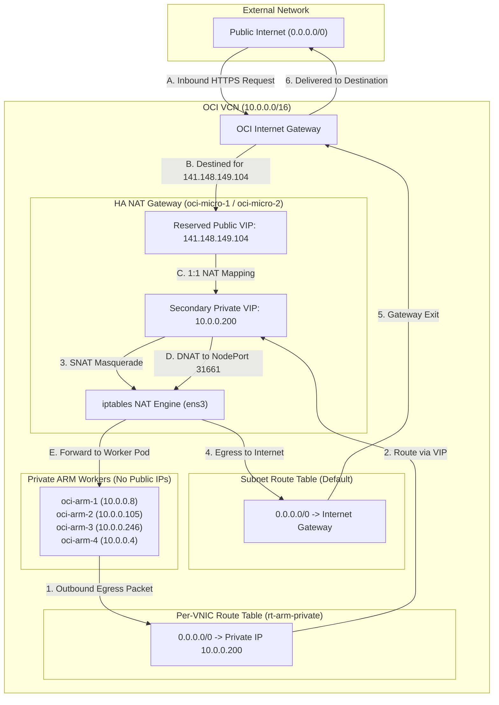

# Zero-Public-IP Architecture & Egress Routing

This document describes how all worker instances (`oci-arm-1`, `oci-arm-2`, `oci-arm-3`, `oci-arm-4`) operate with **zero public IP addresses**, isolating them from external attacks while preserving full outbound egress and secure administrative access.

---

## 🛡️ Core Principles

1. **Zero Public Attack Surface:** Worker VNICs have `assign-public-ip: false`. No public IPv4 is allocated or reachable directly over the internet.
2. **Deterministic Route Tables:** Rather than modifying the shared subnet route table (which would break outbound routing on the micro NAT gateways), a dedicated route table (`rt-arm-private`) is attached directly to the primary VNICs of the ARM nodes.
3. **Transparent Outbound SNAT:** All outbound traffic (`0.0.0.0/0`) from workers is forwarded by OCI's virtual network fabric to the HA private VIP `10.0.0.200`.

---

## 🚦 Packet Flowchart (Ingress & Egress)



---

## 🗺️ Route Table Separation: The Clean Solution

In standard OCI VCN setups, an entire subnet shares a single route table. If the default route (`0.0.0.0/0`) on the subnet route table were pointed to `10.0.0.200`:
- **Routing Loop / Blackhole:** The gateway VM (`oci-micro-1`) would attempt to send its own outbound internet traffic back to `10.0.0.200`, causing an immediate kernel packet drop or infinite loop.

### The Solution: Per-VNIC Route Association

1. **Subnet Route Table (`Default Route Table for vcn-20260929-0052`):**
   - Destination: `0.0.0.0/0` ➔ Target: `Internet Gateway`
   - Applies to `oci-micro-1` and `oci-micro-2` so they can route egress directly to the OCI edge.

2. **Per-VNIC Route Table (`rt-arm-private`):**
   - OCID: `ocid1.routetable.oc1.phx.aaaaaaaabm6h4yqzyypm777bsurfwnx4ec3vuwijzpcge4wrllypl2bzwxya`
   - Destination: `0.0.0.0/0` ➔ Target: **Private IP `10.0.0.200`**
   - Attached individually to the primary VNIC of every private worker node:
     ```bash
     oci network vnic update \
       --vnic-id <worker_primary_vnic_ocid> \
       --route-table-id "ocid1.routetable.oc1.phx.aaaaaaaabm6h4yqzyypm777bsurfwnx4ec3vuwijzpcge4wrllypl2bzwxya"
     ```

---

## 🔑 Administrative Access: Secure Bastion ProxyJump

Because workers lack public IPs, administrative SSH access is configured via SSH `ProxyJump` in `~/.ssh/config`. Connections jump through the hardened bastion `oci-micro-1` (`132.226.113.118`):

```ssh-config
# Gateway & Bastion Host
Host oci-micro-1
    HostName 132.226.113.118
    User ubuntu
    IdentityFile ~/.ssh/id_rsa
    StrictHostKeyChecking accept-new

Host oci-micro-2
    HostName 129.153.212.1
    User ubuntu
    IdentityFile ~/.ssh/id_rsa
    StrictHostKeyChecking accept-new

# Zero-Public-IP Private Workers
Host oci-arm-1
    HostName 10.0.0.8
    User ubuntu
    ProxyJump oci-micro-1
    IdentityFile ~/.ssh/id_rsa
    StrictHostKeyChecking accept-new

Host oci-arm-2
    HostName 10.0.0.105
    User ubuntu
    ProxyJump oci-micro-1
    IdentityFile ~/.ssh/id_rsa
    StrictHostKeyChecking accept-new

Host oci-arm-3
    HostName 10.0.0.246
    User ubuntu
    ProxyJump oci-micro-1
    IdentityFile ~/.ssh/id_rsa
    StrictHostKeyChecking accept-new

Host oci-arm-4
    HostName 10.0.0.4
    User ubuntu
    ProxyJump oci-micro-1
    IdentityFile ~/.ssh/id_rsa
    StrictHostKeyChecking accept-new
```

---

## 🔒 Security List Enforcement

Security rules configured in `Default Security List for vcn-20260929-0052`:

- **Intra-VCN Traffic:** All protocols allowed for CIDR `10.0.0.0/16`.
- **Inbound SSH Bastion:** TCP `22` allowed from `0.0.0.0/0` (only gateway nodes possess public IPs).
- **Public Ingress Services:** TCP `80` (HTTP) and `443` (HTTPS) allowed from `0.0.0.0/0`.
- **WireGuard / VPN:** UDP `51820` and Tailscale UDP `41641` allowed from `0.0.0.0/0`.
- **ICMP MTU Discovery:** ICMP Type 3, Code 4 permitted from `0.0.0.0/0` for Path MTU discovery.
