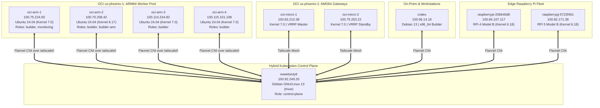

# Hybrid K3s Cluster Topology & Capacity Scaling

This document details the multi-cloud, hybrid Kubernetes (K3s) cluster architecture, Tenancy Ampere A1 quota allocation, Flannel CNI over Tailscale mesh, and node role scheduling.

---

## 📊 Always Free Tier Quota Maximization

Oracle Cloud Infrastructure provides an **Always Free Ampere A1 Flex** quota of:
- **Maximum 4 OCPUs**
- **Maximum 24 GB Memory**

To maximize distributed resilience and prevent noisy-neighbor contention across builds and services, the tenancy is divided evenly across **four independent 1-OCPU / 6-GB instances**:

```
Tenancy Ampere A1 Pool (4 OCPUs / 24 GB RAM)
├── oci-arm-1: 1 OCPU, 6 GB RAM (Builder, Monitoring, Orchestration)
├── oci-arm-2: 1 OCPU, 6 GB RAM (Bio App, Traefik, User Services)
├── oci-arm-3: 1 OCPU, 6 GB RAM (Tekton Pipeline Worker, SRE Console)
└── oci-arm-4: 1 OCPU, 6 GB RAM (Tekton Pipeline Worker, SRE Console)
```

Combined with the two AMD64 instances (`oci-micro-1` and `oci-micro-2`, 1 vCPU / 1 GB RAM each), the tenancy consumes 100% of available compute resources without incurring billing charges.

---

## 🌐 10-Node Hybrid Cluster Mesh Diagram



---

## 🔌 Networking: Flannel CNI over Tailscale Overlay

In standard K3s clusters, Flannel binds to the node's primary Ethernet interface (`ens3` or `eth0`). However, because the nodes span different subnets, clouds, and on-premises physical locations, standard L2 broadcast/VXLAN encapsulation fails.

### Solution: `--flannel-iface=tailscale0`
All worker nodes are instructed to bind Flannel encapsulation to their virtual WireGuard interface:
```bash
/usr/local/bin/k3s agent \
    --flannel-iface=tailscale0 \
    --node-name=oci-arm-3 \
    --node-label custom-hostname=oci-arm-3 \
    --node-label role=builder \
    --node-label builder=arm64 \
    --node-label arch=arm64
```

### Key Network Advantages
1. **End-to-End Encryption:** Pod-to-pod network traffic between any two nodes across clouds is encrypted using ChaCha20-Poly1305.
2. **NAT Traversal:** Direct wireguard tunnels punch through NAT boundaries via Tailscale DERP relays.
3. **No Public IP Requirement:** Worker nodes in OCI communicate directly with the on-premise control plane (`100.92.249.20:6443`) over their Tailscale private IP.

---

## 🏷️ Node Labels & Workload Scheduling

Standardized labels ensure deterministic pod scheduling across architectures and roles:

| Label Key | Value | Purpose |
| :--- | :--- | :--- |
| `node-role.kubernetes.io/builder` | `true` | Declares node eligibility for Tekton and CI/CD pipelines |
| `builder` | `arm64` | Targets ARM64 Docker/Kaniko builds |
| `arch` | `arm64` | Hardware architecture affinity |
| `custom-hostname` | `<hostname>` | Stable identifier independent of DHCP |

### DaemonSets Active Across Fleet
- **`svclb-traefik`:** K3s Service LoadBalancer proxying external ingress.
- **`otel-collector-contrib`:** OpenTelemetry collector capturing metrics, traces, and host telemetry.
- **`node-sre-console`:** Local SRE diagnostics console running on host PID namespace.
