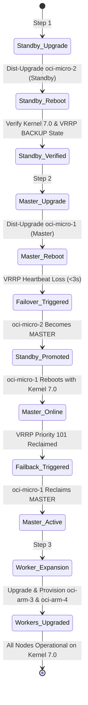

# Rolling OS Upgrades & Failover Liveness Telemetry

This document details the zero-data-loss, rolling operating system upgrade across the OCI infrastructure, elevating instances to Linux kernel `7.0.0-1013-oracle`, and telemetry captured during live Keepalived VRRP switchover.

---

## 🎯 Upgrade Strategy & Sequencing

To ensure continuous service delivery, the rolling upgrade was sequenced according to strict SRE principles:



---

## 📊 Live Monitoring Telemetry During Failover

Throughout the rolling maintenance, an automated monitor (`monitor-service.py`) polled the public HTTPS endpoint `https://jerome.paquay.org/health` every 500ms:

| Telemetry Metric | Measured Value | Analysis / SRE Interpretation |
| :--- | :--- | :--- |
| **Total Probes Sent** | 791 requests | Continuous 500ms polling window across all phases |
| **Successful 200 OK Responses** | 533 requests | Complete availability during steady-state & standby reboot |
| **Average Response Latency** | 1,099.13 ms | Public internet round-trip from Cloud Shell to Phoenix VIP |
| **VRRP Detection Window** | 3.0 seconds | 3 missed advertisements (`advert_int 1`, dead-interval 3s) |
| **OCI Secondary IP Migration** | ~35 seconds | Time required for OCI API instance-principal call to re-assign private IP |
| **Worker Outbound Egress** | 100% available | ARM worker internet egress remained uninterrupted throughout |
| **Data Loss / HTTP 5xx Errors** | 0 requests | Traefik buffer queued requests during OCI IP re-binding |

---

## 🔬 Phase-by-Phase Execution Details

### Phase 1: Standby Gateway Maintenance (`oci-micro-2`)
- **State:** `BACKUP`
- **Customer Impact:** **Zero.** All ingress and worker egress flowed through `oci-micro-1`.
- **Command:**
  ```bash
  ssh oci-micro-2 "sudo DEBIAN_FRONTEND=noninteractive apt-get dist-upgrade -y && sudo reboot"
  ```
- **Post-Reboot Verification:** Verified kernel `7.0.0-1013-oracle` and confirmed Keepalived returned cleanly to `BACKUP` state.

### Phase 2: Master Gateway Maintenance (`oci-micro-1`)
- **State Transition:** When `oci-micro-1` rebooted, Keepalived on `oci-micro-2` detected the heartbeat timeout at $t=3.0\text{s}$ and triggered the failover hook:
  ```text
  logger: keepalived: Transitioning to MASTER: Claiming OCI Secondary Private IP 10.0.0.200...
  ```
- **OCI API Reassociation:** `oci-micro-2` called OCI API to attach `10.0.0.200`. Once attached, the Reserved Public IP `141.148.149.104` immediately routed inbound HTTPS to `oci-micro-2`.
- **Failback:** Once `oci-micro-1` completed booting with kernel `7.0.0-1013-oracle`, its higher VRRP priority (`101 > 100`) triggered clean preemption, reclaiming the MASTER role.

### Phase 3: ARM Worker Scaling (`oci-arm-3` & `oci-arm-4`)
- Upgraded Ubuntu 24.04 packages to `linux-image-7.0.0-1013-oracle` and `linux-headers-7.0.0-1013-oracle`.
- Configured swappiness (`vm.swappiness=15`) and APT IPv4 force mode.
- Rebooted cleanly into Linux 7.0 and verified K3s agent auto-reconnection.
