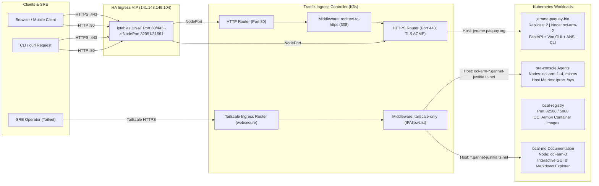

# Published Services, Ingress & TLS Architecture

This document details the customer-facing workloads, telemetry agents, and edge routing architecture deployed across the private ARM worker cluster.

---

## 🏛️ Ingress Architecture & Request Routing

---

## 🚀 Deployed Workloads

### 1. Jerome Paquay Bio & Portfolio (`jerome.paquay.org`)
- **Domain:** `jerome.paquay.org`
- **Backend:** FastAPI asynchronously serving typed REST endpoints, ANSI TrueColor CLI outputs, and an interactive Vim-inspired browser SPA.
- **Port 80 to 443 Enforcement:** Traefik Middleware `redirect-to-https` permanently redirects (`HTTP 308`) any plain HTTP traffic to HTTPS.
- **TLS Certificate:** Managed by cert-manager with Let's Encrypt production ACME issuer (`letsencrypt-prod`).
- **Endpoints:**
  - `GET /`: Renders TrueColor ANSI banner for `curl` clients; renders interactive Vim GUI for browser clients.
  - `GET /vim`: Interactive multi-buffer Vim terminal workspace with hotkeys (`1-4`, `t`, `h`, `?`).
  - `GET /api/v1/portfolio`: Typed JSON bio and project highlights.
  - `GET /api/v1/garage`: 10-node infrastructure inventory.
  - `GET /api/v1/persona/jekyll` & `/hyde`: Dynamic persona engine.
  - `GET /api/v1/telemetry`: Node execution runtime telemetry.

### 2. SRE Node Diagnostics Consoles (`sre-console`)
- **Namespace:** `sre-console`
- **Scope:** Dedicated agent per node (`oci-arm-1`, `oci-arm-2`, `oci-arm-3`, `oci-arm-4`, `oci-micro-1`, `oci-micro-2`, `sweetsixty6`).
- **Host Isolation:** Runs with `hostPID: true` and read-only mounts of `/host/proc`, `/host/sys`, `/host/root` to inspect CPU, memory, cgroups, and disk performance.
- **Internal Access:** Secured over Tailscale MagicDNS (`<node>.gannet-justitia.ts.net`).

### 3. Local Container Registry
- **Namespace:** `container-registry`
- **Service:** `local-registry` exposed via NodePort `32500` across all cluster nodes.
- **Internal Cluster URL:** `http://local-registry.container-registry.svc.cluster.local:5000`
- **Host-Local Loopback:** `http://localhost:32500` on any cluster node.
- **Usage:** Serves internally built ARM64 images (`node-sre-console`, `jerome-paquay-bio`, `local-md-docs`).

### 4. Local Markdown Explorer (`local-md`)
- **Technology:** React 19 + TypeScript + Vite frontend with FastAPI Python backend.
- **Features:** Rich Markdown rendering, Mermaid diagram integration, live full-text search (`Cmd+K`), interactive GUI file loading, and zero-PII De-ID layer.
- **Target Node:** Deployed to newly provisioned ARM64 nodes (`oci-arm-3` / `oci-arm-4`).
- **Ingress Constraint:** Tailscale IP only via Traefik `ipAllowList` middleware (`100.64.0.0/10`).
