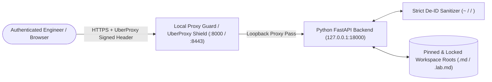

# Engineering, Security & Architecture Review — `local-md`

- **Repository**: [`jpaquay/local-md`](https://github.com/jpaquay/local-md)
- **Author & Maintainer**: **Jerome CG Paquay (`@jpaquay`)**
- **License**: **Creative Commons Attribution-ShareAlike 4.0 International (`CC BY-SA 4.0`)**
- **Review Date**: September 2026

---

## 1. Executive Summary

`local-md` is a high-performance, single-page Markdown explorer, Codelab presentation engine, and repository documentation viewer engineered for **Zero-Trust Cloudtop Workstations** and local developer environments. It combines a **React 19 + TypeScript + Vite** SPA frontend with an asynchronous **Python FastAPI / Uvicorn** backend (`server.py`) isolated on loopback (`127.0.0.1:18000`) behind Google Cloud / Local Proxy Guard (`:8000`).

---

## 2. System Architecture & Data Flow

---

## 3. Security, Hygiene & Code Quality Audit

| Audit Dimension | Status | Findings & Verification |
| :--- | :---: | :--- |
| **Secret & PII Hygiene** | ✅ PASS | Strict De-ID layer scrubs usernames, home paths, and Cloudtop hostnames across `/api/browse`, `/api/file`, `/api/config`, and `/api/search`. `.env` is ignored via `.gitignore`; `.env.example` uses safe `~` defaults. |
| **Zero-Trust Network Isolation** | ✅ PASS | Backend binds strictly to `127.0.0.1:18000` when Local Proxy Guard is active on `:8000`, preventing unauthenticated lateral network access. |
| **Path Traversal Protection** | ✅ PASS | `server.py` enforces canonical path resolution (`os.path.realpath`) and root lock (`LOCK_ROOT=true`) boundary checks on all file and directory queries. |
| **Idempotent Process Lifecycle** | ✅ PASS | `run.sh` gracefully detects and terminates stale processes on target ports before spawning, eliminating `EADDRINUSE` race conditions. |
| **Open Licensing & Governance** | ✅ PASS | Standardized under **CC BY-SA 4.0** attributed to **Jerome CG Paquay (`@jpaquay`)** with full `CONTRIBUTING.md` guidelines. |

---

## 4. Key Engineering Recommendations

1. **Automated Pre-Commit Secret Scanning**: Maintain `git-secrets` pre-commit hooks on all contributor workstations to ensure zero accidental credential commits.
2. **Bounded Search Indexing**: Keep depth and file-size bounds active in `/api/search` (`MAX_SEARCH_DEPTH`) when indexing monorepo trees.
