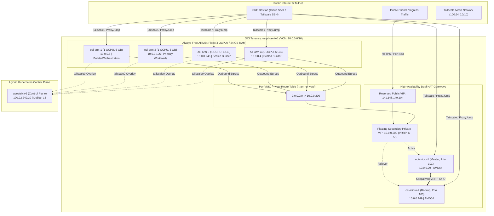

# Oracle Cloud Infrastructure & K3s Cluster Documentation

Welcome to the comprehensive engineering documentation for the Oracle Cloud Infrastructure (OCI) `us-phoenix-1` tenancy, High-Availability Gateway, Zero-Public-IP private subnet routing, and 10-node hybrid Kubernetes (K3s) cluster.

---

## 🏗️ Architecture Overview

The infrastructure decouples public ingress/egress from compute workloads. All worker nodes are stripped of public IP addresses and placed in a private routing realm. Outbound internet egress is routed through an active/standby Keepalived VRRP cluster that manages a floating private VIP and public IP. The Kubernetes cluster spans OCI Ampere A1 ARM64 flex instances, AMD64 micro gateways, on-premises nodes, and Raspberry Pi edge devices connected over a Flannel-on-Tailscale overlay mesh network.

---

## 📚 Documentation Structure

This documentation suite is organized into modular engineering references:

| Section | Document | Description |
| :--- | :--- | :--- |
| **01** | [01-ha-gateway-vrrp.md](file:///home/jpaquay/docs/01-ha-gateway-vrrp.md) | High-Availability NAT Gateway, Keepalived VRRP ID 77, and dynamic OCI VIP reassociation |
| **02** | [02-zero-public-ip-routing.md](file:///home/jpaquay/docs/02-zero-public-ip-routing.md) | Complete elimination of public IPs from workers, per-VNIC route tables, and bastion access |
| **03** | [03-cluster-expansion-topology.md](file:///home/jpaquay/docs/03-cluster-expansion-topology.md) | 10-node hybrid K3s cluster, Ampere A1 quota allocation (4 OCPU/24GB), and Flannel on Tailscale |
| **04** | [04-rolling-upgrades.md](file:///home/jpaquay/docs/04-rolling-upgrades.md) | Sequential kernel 7.0 upgrades, rolling reboot lifecycle, and 500ms liveliness monitoring results |
| **05** | [05-services-ingress-tls.md](file:///home/jpaquay/docs/05-services-ingress-tls.md) | Deployed applications: bio portal, SRE consoles, Traefik ingress, and ACME Let's Encrypt TLS |
| **06** | [06-operations-runbook.md](file:///home/jpaquay/docs/06-operations-runbook.md) | SRE runbook, verification procedures, failover testing, and node onboarding guide |
| **07** | [ARCHITECTURE_REVIEW.md](file:///home/jpaquay/docs/ARCHITECTURE_REVIEW.md) | Engineering, security & architecture review of `local-md` portal engine |

---

## 🖥️ Live Tenancy & Cluster Matrix

### Compute Nodes Inventory

| Node Name | Shape / Type | Specs | Private IP | Tailscale IP | Role / Workload | Kernel |
| :--- | :--- | :--- | :--- | :--- | :--- | :--- |
| `oci-micro-1` | `VM.Standard.E2.1.Micro` | 1 vCPU / 1 GB | `10.0.0.29` | `100.83.210.38` | VRRP Master Gateway, NAT, SSH Bastion | `7.0.0-1013-oracle` |
| `oci-micro-2` | `VM.Standard.E2.1.Micro` | 1 vCPU / 1 GB | `10.0.0.149` | `100.75.253.22` | VRRP Standby Gateway, NAT | `7.0.0-1013-oracle` |
| `oci-arm-1` | `VM.Standard.A1.Flex` | 1 OCPU / 6 GB | `10.0.0.8` | `100.75.224.60` | K3s Worker, Monitoring, Builder, Tekton | `7.0.0-1013-oracle` |
| `oci-arm-2` | `VM.Standard.A1.Flex` | 1 OCPU / 6 GB | `10.0.0.105` | `100.70.208.42` | K3s Worker, Bio App (`jerome.paquay.org`) | `6.17.0-1020-oracle` |
| `oci-arm-3` | `VM.Standard.A1.Flex` | 1 OCPU / 6 GB | `10.0.0.246` | `100.114.234.82` | K3s Worker, Scaled Builder, SRE Console | `7.0.0-1013-oracle` |
| `oci-arm-4` | `VM.Standard.A1.Flex` | 1 OCPU / 6 GB | `10.0.0.4` | `100.115.101.108` | K3s Worker, Scaled Builder, SRE Console | `7.0.0-1013-oracle` |
| `sweetsixty6` | Baremetal / On-Prem | x86_64 | Local | `100.92.249.20` | K3s Control Plane Server | `6.12.107+deb13` |
| `cralex` | Workstation / Remote | x86_64 | Local | `100.66.14.16` | K3s Worker, x86_64 Builder | `6.12.107+deb13` |
| `raspberrypi` | Raspberry Pi 4 Model B | aarch64 | Local | `100.84.107.117` | K3s Edge Worker | `6.18.29+rpt` |
| `raspberrypj` | Raspberry Pi 5 Model B | aarch64 | Local | `100.82.171.38` | K3s Edge Worker | `6.18.39+rpt` |

---

## 🔒 Security Posture

1. **Zero External Surface on Workers:** Workers have no public IP addresses (`assign-public-ip: false`). Port scans against worker IPs from outside the VCN return connection drops.
2. **Dedicated Private Egress Route Table:** Using `rt-arm-private` attached directly to worker VNICs ensures outbound egress never routes via the default internet gateway, routing strictly via `10.0.0.200`.
3. **Encrypted Inter-Node Communication:** All Kubernetes pod-to-pod and node-to-node communications traverse WireGuard-encrypted Tailscale tunnels on interface `tailscale0`.
4. **Automated SSL/TLS:** Production certificates are issued automatically by cert-manager with Let's Encrypt HTTP01 validation, terminated by Traefik.
